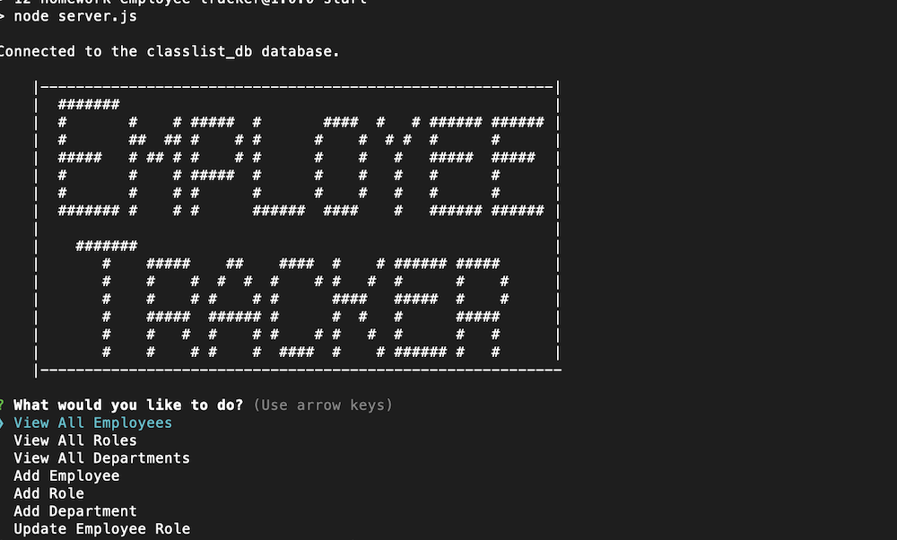

  
  
  # Employee Tracker
  ## Description
  NodeJS project utilizing SQL database to maintain employees, roles, and departments.

  Developers frequently have to create interfaces that allow non-developers to easily view and interact with information stored in databases. These interfaces are called **content management systems (CMS)**. Your assignment this week is to build a command-line application from scratch to manage a company's employee database, using Node.js, Inquirer, and MySQL.

  Because this application won’t be deployed, you’ll also need to create a walkthrough video that demonstrates its functionality and all of the following acceptance criteria being met. You’ll need to submit a link to the video and add it to the README of your project.
  
  ## Table of Contents
  - [Installation](#installation)
  - [Usage](#usage)
  - [Contributing](#contributing)
  - [License](#license)
  - [Questions](#questions)
  ## Installation
  npm i
  ## Usage
  npm start

  ## Testing
  None
  ## Contributing
  Open Source
  
  
  ## License
  This project is protected under MIT License.

[License Documentation](https://opensource.org/licenses/MIT)

  ## Screenshot and Links
  [GitHub Repository](https://github.com/tallen1985/12-Homework-Employee-Tracker)

  [Link to Video](https://watch.screencastify.com/v/r5nziJSj8kkuafHIVjpU)
  
  
  ## Questions
  [Refer to Github Profile: tallen1985](http://www.github.com/tallen1985)
  
  Any additional questions, reach me at my email jake.allen@me.com
  